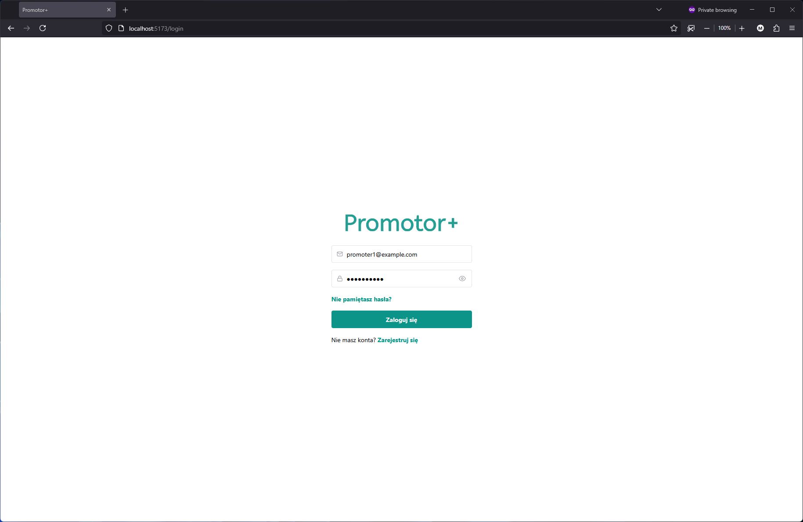
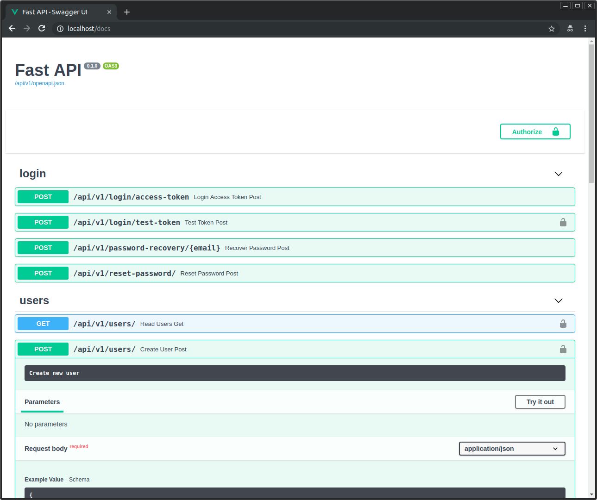

# Promotor+: zarządzanie pracami dyplomowymi

## Funkcje i technologie

- ⚡ [**FastAPI**](https://fastapi.tiangolo.com) dla backendu API w Pythonie.
    - 🧰 [SQLModel](https://sqlmodel.tiangolo.com) do interakcji z bazą danych SQL w Pythonie (ORM).
    - 🔍 [Pydantic](https://docs.pydantic.dev), używany przez FastAPI, do walidacji danych i zarządzania ustawieniami.
    - 💾 [PostgreSQL](https://www.postgresql.org) jako baza danych SQL.
- 🚀 [React](https://react.dev) dla frontendu.
    - 💃 Użycie TypeScript, hooks, Vite i innych elementów nowoczesnego stosu frontendowego.
    - 🎨 [Chakra UI](https://chakra-ui.com) dla komponentów frontendowych.
    - 🦇 Wsparcie dla trybu ciemnego.
- 🐋 [Docker Compose](https://www.docker.com) dla rozwoju i produkcji.
- 🔒 Domyślnie bezpieczne hashowanie haseł.
- 🔑 Uwierzytelnianie JWT (JSON Web Token).
- ✅ Testy z [Pytest](https://pytest.org).
- 📞 [Traefik](https://traefik.io) jako reverse proxy / load balancer.
- 🏭 CI (ciągła integracja) i CD (ciągłe wdrażanie) oparte na GitHub Actions.

## Instalacja zależności

TODO

## Uruchomienie

TODO

## Wygląd aplikacji

### Dashboard Login

### Dashboard - Admin

### Dashboard - Create User

### Dashboard - Items

### Dashboard - User Settings

### Dashboard - Dark Mode

### Interactive API Documentation

